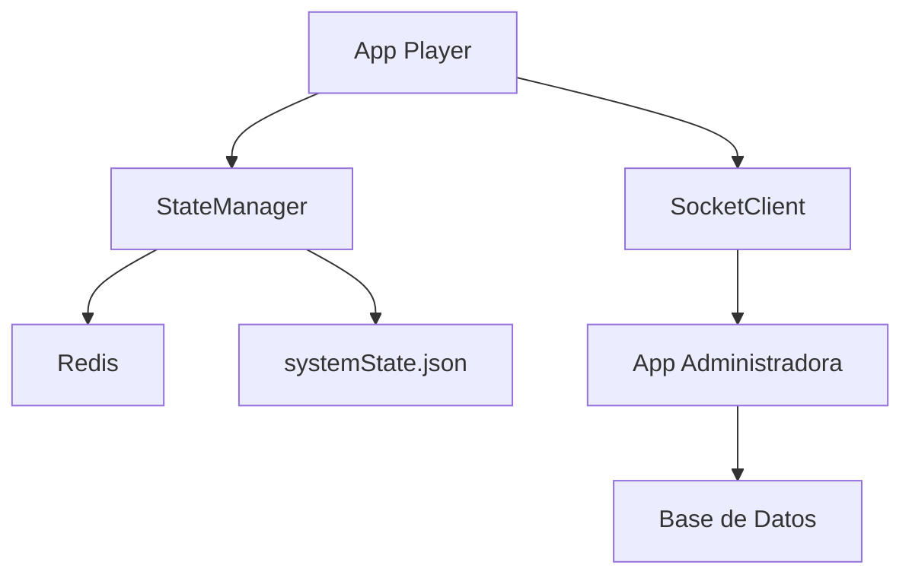
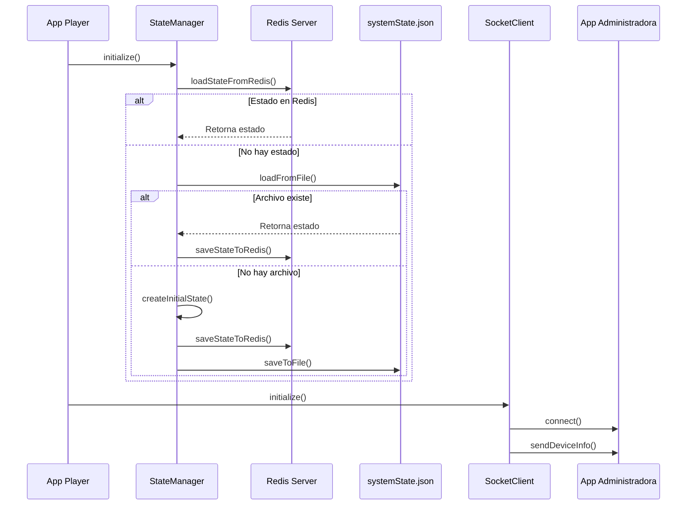
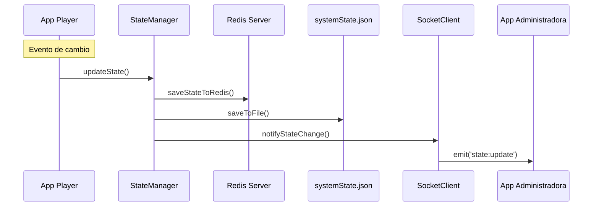
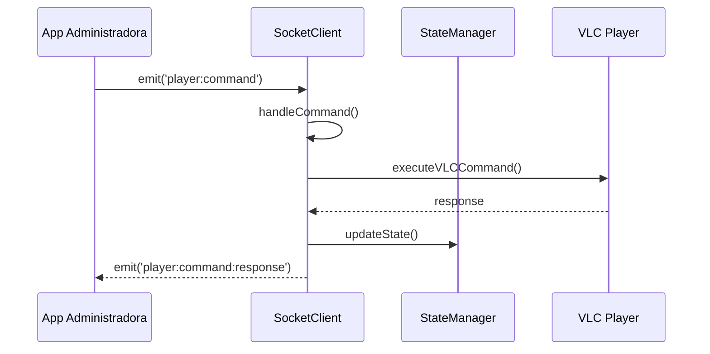
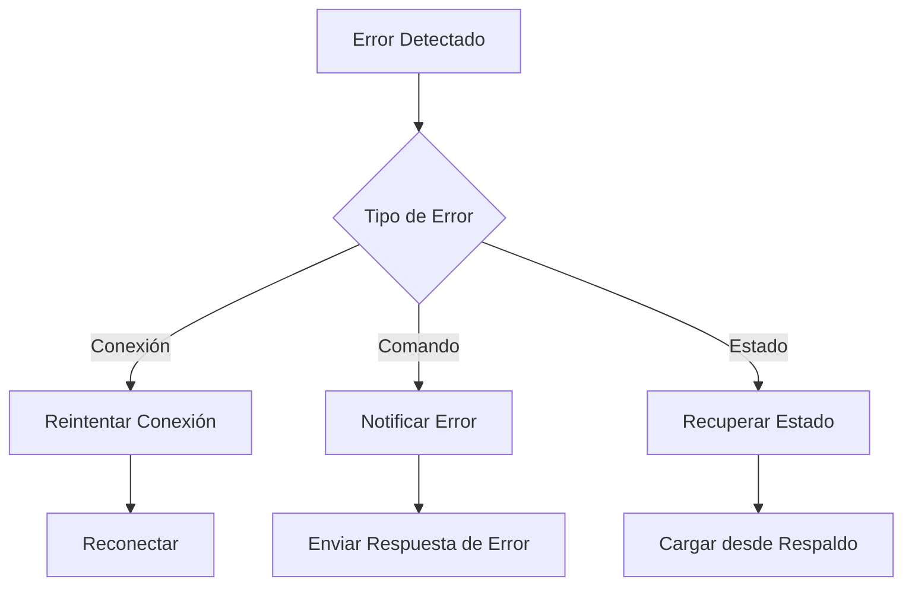

# Flujo del Sistema de Estado en Tiempo Real

## 1. Arquitectura General

## 2. Flujo de Inicialización

## 3. Flujo de Actualización de Estado

## 4. Flujo de Comandos

## 5. Componentes Principales

### StateManager
- Gestiona el estado centralizado
- Mantiene sincronización entre Redis y archivo
- Proporciona métodos para actualizar secciones específicas
- Maneja la persistencia de datos

### SocketClient
- Gestiona la comunicación en tiempo real
- Maneja comandos y eventos
- Sincroniza estado con la app administradora
- Implementa reconexión automática

### Redis
- Almacenamiento primario del estado
- Proporciona acceso rápido
- Mantiene consistencia entre instancias

### systemState.json
- Respaldo del estado
- Persistencia local
- Recuperación en caso de fallo

## 6. Eventos y Comandos

### Eventos Principales
1. `player:register` - Registro inicial del dispositivo
2. `player:state` - Actualización de estado
3. `player:command` - Comandos de control
4. `player:command:response` - Respuestas a comandos

### Comandos VLC
1. `vlc:play` - Reproducir
2. `vlc:pause` - Pausar
3. `vlc:stop` - Detener
4. `vlc:fullscreen` - Pantalla completa
5. `vlc:snapshot` - Captura de pantalla

## 7. Manejo de Errores

## 8. Consideraciones de Rendimiento

1. **Caché en Memoria**
   - Estado mantenido en memoria
   - Actualizaciones diferenciales
   - Sincronización periódica

2. **Persistencia**
   - Redis como almacenamiento primario
   - Archivo como respaldo
   - Sincronización asíncrona

3. **Optimización de Red**
   - Envío de cambios incrementales
   - Compresión de datos
   - Reintentos inteligentes

## 9. Mejores Prácticas

1. **Gestión de Estado**
   - Estado inmutable
   - Actualizaciones atómicas
   - Validación de datos

2. **Comunicación**
   - Protocolo de eventos estandarizado
   - Manejo de desconexiones
   - Reconexión automática

3. **Seguridad**
   - Autenticación de dispositivos
   - Validación de comandos
   - Protección de datos sensibles 